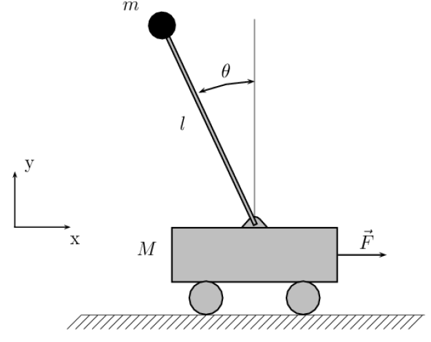
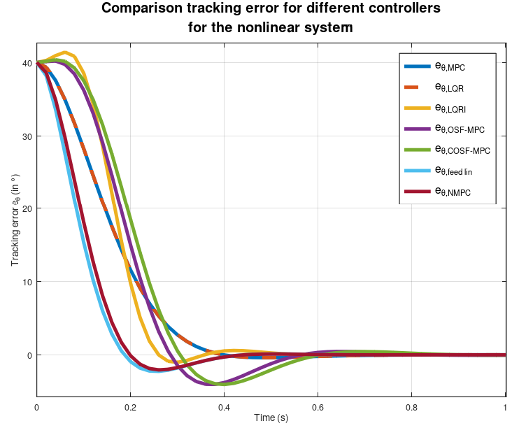
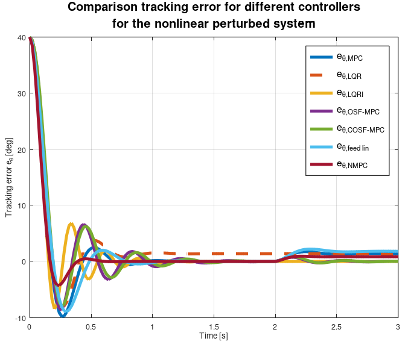

# Inverted Pendulum on a Cart: Control Law Performance Study
Comparative analysis of different control strategies (state feedback, LQR, MPC) to equilibrate an inverted pendulum system mounted on a movable cart.

 <a href= "https://img.shields.io/badge/github-repo-blue?logo=github"> </a>
<a href= "https://img.shields.io/badge/MATLAB-R_2022a-orange"> </a>
<a href= "https://img.shields.io/badge/Octave-R"> </a>
<a href= "https://img.shields.io/badge/License-MIT-yellow"> </a>

---

## 📌 Overview

This project investigates the performance of various control laws for stabilizing an **inverted pendulum on a cart**, using the dynamics of this nonlinear system. 
For now, the study compares:

<!-- - **Linear State Feedback Control (SF)** -->
- **Linear Quadratic Regulator and with Integrator (LQR and LQRI)**
- **Model Predictive Control (MPC)**
- **Offset-Free MPC with Integrator (OSF-MPC)**
- **Constrained Offset-Free MPC (COSF-MPC)**
- **Feedback Linearization (feed lin)**
- **Nonlinear Model Predictive Control (NMPC)**

Additionally, the robustness of each controller is evaluated under **model parameter uncertainties** and **external disturbances**.

---

## 🔧 System Description

The inverted pendulum on a cart is a classic control problem with nonlinear dynamics. 
The system is modeled using:
- **Lagrange equations**
- **State-space representation** (linearized around the upright equilibrium)
- **Physical parameters**: mass, length, gravity, friction, etc.

 </img>

The nonlinear dynamics of the inverted pendulum on a cart are derived using the Lagrangian method:

$$
\begin{cases}
(M + m)\ddot{x} - ml\ddot{\theta}\cos(\theta) + ml\dot{\theta}^2\sin(\theta) = F(t) - \psi\dot{x} \\
ml^2\ddot{\theta} - ml\ddot{x}\cos(\theta) + mgl\sin(\theta) = -\phi\dot{\theta}
\end{cases}
$$

After simplification, the system is described by:

$$
\begin{bmatrix}
 \ddot{x} \\ 
 \ddot{\theta}   
\end{bmatrix} = \frac{1}{D(\theta)} \begin{bmatrix}
 lF(t) - l\psi\dot{x} - ml^2\dot{\theta}^2\sin(\theta) - mgl\sin(\theta)\cos(\theta) -\phi\dot{\theta}\cos(\theta)  \\  
 -(M + m)g\sin(\theta) - \frac{M + m}{ml}\phi\dot{\theta} + \cos(\theta)F(t) - \psi\dot{x}\cos(\theta) - ml\dot{\theta}^2\sin(\theta)\cos(\theta)  
\end{bmatrix} 
$$

with

$$
D(\theta) = l \left( M + m\sin^2(\theta) \right),
$$

where:
- $M$: Mass of the cart
- $m$: Mass of the pendulum
- $l$: Length of the pendulum rod
- $g$: Gravitational acceleration
- $F(t)$: External force applied to the cart
- $\psi$: Friction coefficient for the cart
- $\phi$: Friction coefficient for the pendulum joint
- $\theta$: Pendulum angle from vertical
- $x$: Cart position
---

## 📊 Control Strategies

<!-- ### 1. **State Feedback Control**
- Uses **pole placement** based on the approximate linearized system for stabilization. -->
<!-- - Assumes perfect model knowledge. **LQR** -->

### 1. **Model Predictive Control (MPC)**

- Optimizes control actions over a finite horizon.

### 2. **Offset-Free MPC with Integrator**

- Extends MPC with an **integral action** to eliminate steady-state errors.
- Robust to constant disturbances.

### 3. **Constrained Offset-Free MPC**

- Combines offset-free properties with **input/output constraints**.
<!-- - Evaluates robustness to parameter mismatches. - Handles constraints explicitly. -->

### 4. **Feedback linearization**

- Transformes the nonlinear control system into an equivalent linear control system by a proper choice of input.

### 5. **Nonlinear MPC**

- This solves an MPC optimization problem which takes into account the nonlinear dynamics of the inverted pendulum on a cart.

---

## 🚩Trajectory scenario

- **Setpoint step**: return to the **equilibrium position** ($\theta=0$) from an initial condition with an angle $\theta_0 = 60°$ and zero velocities.


### 📈 Visualize Results

<!-- - Time-domain responses (pendulum angle, cart position).
- Control effort plots.
- Robustness analysis (Monte Carlo simulations). -->

 </img>

 </img>

The performance metrics that can be observed and computed are the following:
- **Rise time**
- **Overshoot**
- **Settling time**
- **Steady-state error**
- **Robustness to:**
  - Mass/length uncertainties ($M$, $m$ and $l$ ±10-20%)
  - Disturbance that appears on $\theta$ at t_pert=2.5s


---

<!--  ## 📝 Key Findings

- **State Feedback**: Simple but sensitive to model errors.
- **MPC**: Better constraint handling but computationally intensive.
- **Offset-Free MPC**: Eliminates steady-state errors; robust to disturbances.
- **Constrained Offset-Free MPC**: Best overall robustness and performance. 

--- -->

## 🛠️ Setup & Requirements

### Prerequisites

- **Matlab R2022a+** or **GNU Octave 6.0+**
- **Control System Toolbox** (Matlab)
- **Optimization Toolbox** (for MPC)

### Installation

1. Clone this repository:
  ```bash
   git clone https://github.com/Matbo77/Inverted_Pendulum_on_a_Cart_Control_Law_Performance_Study.git
  ```
2. Open Matlab/Octave and navigate to the project folder.

---

## 🚀 Usage

### 1. Simulate the System

Run the main script to compare all controllers:

```matlab
mpc_study_case_main;
```

-  The uncertainties/disturbances can be adjust in mpc_study_case_nl.m.


### 2. Customize Controllers

Modify controller tuning in:

- `mpc_study_case_main.m`
- `mpc_study_case_nl.m`


---

## 🤝 Contributing

Contributions are welcome!

Future improvements could include:
- New controller implementations including sliding mode control (SMC),
- Improved robustness tests,
- Assess controllers tracking performance on more comprehensive reference trajectories,
- Documentation enhancements.

---

## 📚 References

1. Menouar MEZIANI and Mourad AKKOUL. “Modélisation et simulation
d’un pendule inversé”. In: Mémoire de fin d’étude de MASTER
ACADEMIQUE Spécialité : AUTOMATIQUE. Université Mouloud
Mammeri de Tizi-Ouzou, Algérie. 2016.
2. Ammar RAMDANI. “Commande prédictive des systèmes dynamiques
: étude comparative avec les régulateurs classiques”. In: Mémoire de
Magister filière génie électrique. Université M’HAMED BOUGARABOUMERDES,
Algérie. 2013.
3. [Inverted_Pendulum_Cart_Simulation Github repo](https://github.com/ssong47/Inverted_Pendulum_Cart_Simulation)
---


